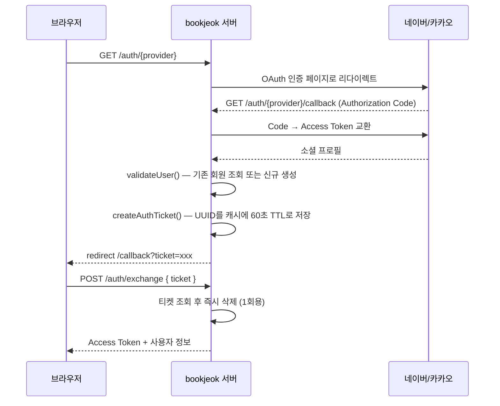
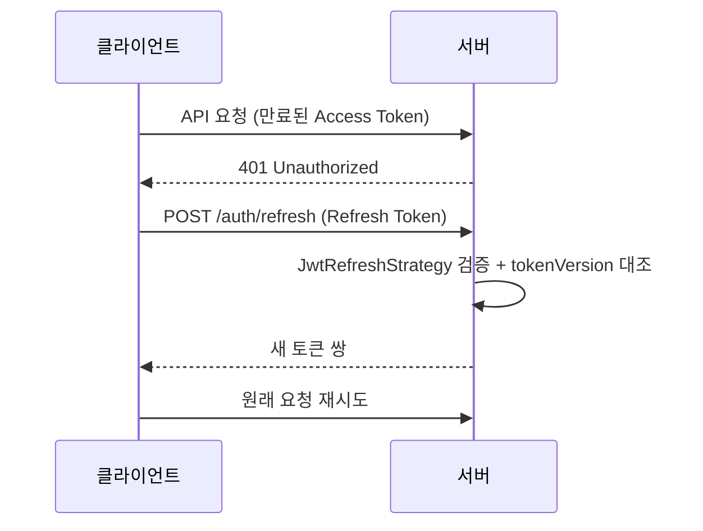

# Auth Module (`features/auth`)

소셜/이메일 로그인, JWT 발급·갱신·무효화, 이메일 인증, 라우트 보호 가드를 담당합니다.

## 1. 폴더 구조

```
auth/
├── auth.module.ts
├── auth.constants.ts
├── controllers/auth.controller.ts
├── services/auth.service.ts
├── strategies/
│   ├── naver.strategy.ts          # 네이버 OAuth 2.0
│   ├── kakao.strategy.ts          # 카카오 OAuth 2.0
│   ├── jwt.strategy.ts            # Access Token 검증
│   └── jwt-refresh.strategy.ts    # Refresh Token 검증
├── guards/
│   ├── email-verified.guard.ts (+ spec)  # 이메일 인증 회원만 통과
│   ├── admin.guard.ts                    # 관리자 전용
│   └── optional-jwt-auth.guard.ts        # 로그인 시 사용자 주입, 아니면 통과
├── decorators/social-auth.decorator.ts
├── dtos/
│   ├── login.dto.ts · register.dto.ts · social-login.dto.ts
└── types/jwt-payload.type.ts
```

## 2. API 엔드포인트

| 메서드 | 경로 (`/auth/...`)         | Rate Limit | 설명                                     |
| ------ | -------------------------- | ---------- | ---------------------------------------- |
| POST   | `/signup`                  | 5회/분     | 이메일 회원가입                          |
| POST   | `/login`                   | 5회/분     | 이메일 로그인                            |
| GET    | `/naver`                   | -          | 네이버 로그인 시작                       |
| GET    | `/naver/callback`          | -          | 네이버 콜백 → 티켓 발급 후 리다이렉트    |
| GET    | `/kakao`                   | -          | 카카오 로그인 시작                       |
| GET    | `/kakao/callback`          | -          | 카카오 콜백 → 티켓 발급 후 리다이렉트    |
| POST   | `/exchange`                | 20회/분    | 1회용 티켓 → 토큰 교환                   |
| POST   | `/refresh`                 | 20회/분    | Access Token 재발급 (Refresh Token 필요) |
| POST   | `/logout`                  | -          | 로그아웃 (`tokenVersion` 증가)           |
| POST   | `/send-verification-email` | 3회/분     | 인증 메일 발송 (Resend)                  |
| POST   | `/verify-email`            | 10회/분    | 인증 링크 토큰 검증                      |

전역 Throttler(60초/120회) 위에 위 엔드포인트들은 개별 제한을 추가로 적용합니다.

## 3. 소셜 로그인 — 1회용 티켓 교환

**토큰을 리다이렉트 URL에 실어 보내지 않습니다.** 쿼리스트링의 JWT는 브라우저 히스토리, 리퍼러 헤더, 중간 프록시·서버 로그에 그대로 남기 때문입니다. 대신 60초짜리 1회용 티켓만 노출합니다.



티켓은 교환 즉시 폐기되며, 60초가 지나거나 이미 사용된 티켓은 `INVALID_OR_EXPIRED_TICKET`으로 거부됩니다.

## 4. 토큰 수명주기



갱신은 클라이언트의 `@bookjeok/api-client` Axios 인터셉터가 자동으로 수행합니다.

### `tokenVersion` 기반 즉시 무효화

`User.tokenVersion` 값이 JWT payload에 포함됩니다. 로그아웃이나 보안 이벤트 시 DB의 `tokenVersion`을 증가시키면, 아직 만료되지 않은 기존 Refresh Token이 **전부 즉시 무효**가 됩니다. 토큰 블랙리스트를 따로 운영하지 않고 정수 하나로 세션을 끊는 방식입니다.

## 5. 이메일 인증

```
POST /auth/send-verification-email  →  Resend로 인증 링크 발송
                                          │
                                          ▼
                    웹 /verify-email  →  POST /auth/verify-email
                                          │
                                          ▼
                                 User.isEmailVerified = true
```

`EmailVerifiedGuard`는 `isEmailVerified !== true`인 요청을 `EMAIL_NOT_VERIFIED` 403으로 차단합니다. 적용 대상은 **중고거래 진입 경로**입니다.

| 적용 지점          | 모듈             |
| ------------------ | ---------------- |
| 판매글 작성        | `used-book-sale` |
| 거래 채팅 개설     | `chat`           |
| 구매자 지정 · 결제 | `order`          |

사기·어뷰징 계정이 거래에 진입하지 못하게 하는 것이 목적입니다.

## 6. 가드

| 가드                       | 용도                                                                                                                                             |
| -------------------------- | ------------------------------------------------------------------------------------------------------------------------------------------------ |
| `AuthGuard('jwt')`         | 일반 인증 필요 라우트                                                                                                                            |
| `AuthGuard('jwt-refresh')` | `/auth/refresh` 전용                                                                                                                             |
| `EmailVerifiedGuard`       | 이메일 인증 완료 회원만                                                                                                                          |
| `AdminGuard`               | 관리자 포털 전용 API                                                                                                                             |
| `OptionalJwtAuthGuard`     | 인증 헤더가 없으면 익명 접근을 허용하고, 유효한 토큰이면 사용자 정보를 주입합니다. 만료·손상된 토큰은 401로 응답해 클라이언트 갱신을 유도합니다. |

## 7. 관련 환경 변수

`JWT_SECRET`, `JWT_REFRESH_SECRET`, `NAVER_CLIENT_ID/SECRET/CALLBACK_URL`, `KAKAO_CLIENT_ID/SECRET/CALLBACK_URL`, `CLIENT_DOMAIN`, `RESEND_API_KEY`

## 8. 관련

- 웹: [`features/auth`](../../../../web/src/features/auth/README.md)
- 메일 발송: [`shared/mail`](../../shared/README.md#mail--resend-메일)
