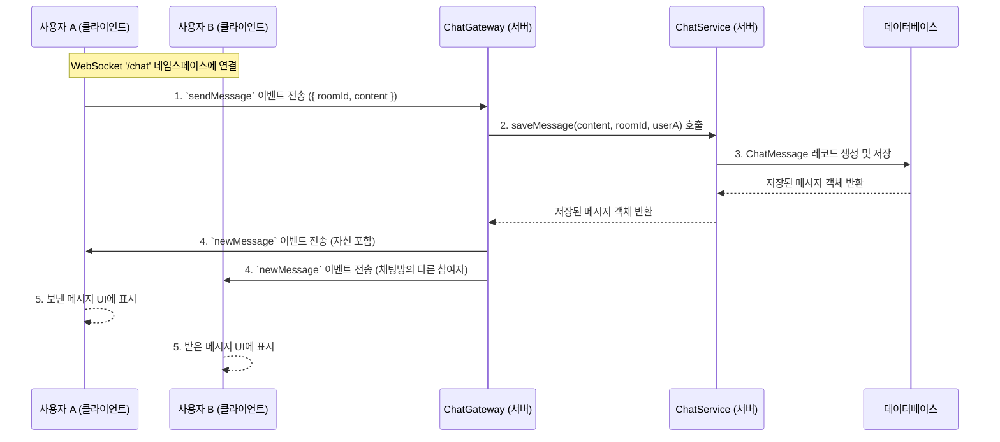

# Chat Module (`features/chat`)

`ChatModule`은 중고 서적 거래를 위한 사용자 간의 실시간 채팅 기능을 제공합니다. WebSocket을 기반으로 메시지를 실시간으로 주고받으며, 채팅방 관리 및 메시지 조회를 위한 REST API도 함께 제공합니다.

## 1. 아키텍처: REST API + WebSocket

채팅 기능은 HTTP 기반의 REST API와 WebSocket 기반의 실시간 통신, 두 가지 방식으로 구현됩니다.

- **REST API (`ChatController`)**: 채팅방 목록 조회, 이전 메시지 불러오기, 채팅방 생성 등 상태를 조회하거나 생성하는 단발성 작업에 사용됩니다.
- **WebSocket (`ChatGateway`)**: 실시간 메시지 송수신, 상대방의 입력 상태 알림, 사용자 접속 상태 관리 등 지속적인 양방향 통신이 필요한 기능에 사용됩니다.

## 2. 주요 파일 및 역할

- **`controllers/chat.controller.ts`**: `/chat` 경로의 REST API 엔드포인트를 정의합니다. 채팅방 목록, 이전 메시지 조회, 채팅방 생성/나가기 등의 기능을 제공합니다.
- **`gateways/chat.gateway.ts`**: `@WebSocketGateway` 데코레이터를 사용하여 웹소켓 서버를 구현합니다. 클라이언트와의 연결 수립/종료, 메시지 수신 및 브로드캐스팅, 특정 `room`으로의 이벤트 전송 등을 담당합니다. 서비스가 만든 메시지·방의 발행(`emitNewMessage`·`emitUserRejoined`·`notifyNewRoom`·`joinRoom`)도 여기 있어, `ChatService`는 Socket.IO `server`·room 이름·직렬화를 직접 다루지 않습니다(두 클래스의 `forwardRef` 상호 의존은 유지).
- **`services/chat.service.ts`**: 채팅 관련 핵심 비즈니스 로직을 처리합니다.
  - `getChatRoom`: 판매글 ID와 구매자 ID를 받아 기존 채팅방을 찾거나, 없으면 새로 생성하여 반환합니다. 같은 프로세스의 동시 요청은 `saleId:buyerId` Map으로 하나로 합칩니다. 새 방과 두 참가자는 `@Transactional()` 한 트랜잭션으로 저장해 참가자 저장이 실패하면 방도 남지 않고, 소켓 참여·신규 방 안내·`chat.room_created`는 커밋 뒤에 나갑니다. **DB 유일성 제약은 없습니다**(방에 구매자 컬럼이 없어 `(판매글, 구매자)`를 표현할 수 없음). 단일 서버에서는 위 Map이 중복 생성을 막으므로 제약을 두지 않습니다. 서버를 여러 대로 늘릴 때만 같은 쌍의 방이 둘 생길 수 있어, 그때 구매자 컬럼과 유일성 제약을 검토합니다.
  - `getChatRooms`: 특정 사용자가 참여 중인 모든 채팅방 목록과 각 방의 마지막 메시지, 안 읽은 메시지 수를 조회합니다.
  - `saveMessage`: 받은 메시지를 데이터베이스에 저장합니다. `imageUrls`가 있으면 `IMAGE` 타입으로 저장하고 `MAX_CHAT_IMAGES`(core)를 넘으면 `CHAT_IMAGE_LIMIT_EXCEEDED`로 거부합니다.
  - `sendTradeMessage`·`notifyOtherBuyersTrading`·`notifySaleSold`·`notifySaleBackOnMarket`: 거래 이벤트가 채팅방에 남기는 `SYSTEM`/`TRADE_STATUS`/`TRADE_ACTION` 메시지와 다른 구매희망자 방 안내를 만듭니다(주문·거래 리스너가 호출).
  - `filterJoinableRoomIds`: `joinRooms`가 요청한 방 중 실제 참여 중인 방만 남깁니다.
  - `leaveRoom`: 채팅방 나가기. 활성 주문이 있으면 막습니다(결제 플래그가 꺼져 있으면 이 검사를 건너뜁니다).
  - `markMessagesAsRead`: 특정 채팅방을 읽음 처리합니다. 읽은 메시지를 건별로 기록하지 않고 `ChatParticipant.lastReadMessageId` 워터마크를 UPDATE 한 번으로 올립니다.
  - `getOpponentLastReadMessageId`: 상대방 참여자의 워터마크를 반환합니다. 내가 보낸 메시지의 읽음 표시 초기값입니다.
- 소켓 연결 인증은 `shared/websocket/authenticate-socket.ts`가 담당합니다. 핸드셰이크의 JWT를 검증하고 탈퇴 계정을 걸러내며, 게이트웨이의 `handleConnection`이 호출합니다. (NestJS 가드는 `@SubscribeMessage` 핸들러에만 걸리고 연결 시점에는 동작하지 않아 가드로 둘 수 없습니다)
- **`listeners/chat-cleanup.listener.ts`**: `user.withdrawn` 이벤트로 탈퇴 회원의 채팅 데이터를 정리합니다.
- **`entities/`**: 채팅 관련 데이터베이스 테이블 스키마를 정의합니다.
  - `chat-room.entity.ts`: 채팅방 정보를 담는 엔티티. `UsedBookSale`과 관계를 맺습니다.
  - `chat-participant.entity.ts`: 어떤 `User`가 어떤 `ChatRoom`에 참여하고 있는지 나타내는 중간 테이블 엔티티. 읽음 워터마크(`lastReadMessageId`)도 여기에 있습니다.
  - `chat-message.entity.ts`: 채팅 메시지의 내용, 보낸 사람, 보낸 시각 등을 담는 엔티티.

## 3. API 및 WebSocket 이벤트 명세

### 3.1. REST API Endpoints

| HTTP Method | 경로 (`/chat/...`)        | 설명                                                                                | 인증 필요         |
| :---------- | :------------------------ | :---------------------------------------------------------------------------------- | :---------------- |
| `POST`      | `/rooms`                  | 특정 판매글에 대한 채팅방을 생성하거나 조회합니다.                                  | ✅ (Access Token) |
| `GET`       | `/rooms`                  | 내가 참여 중인 모든 채팅방 목록을 조회합니다.                                       | ✅ (Access Token) |
| `GET`       | `/rooms/:roomId/messages` | 특정 채팅방의 이전 메시지들을 조회합니다. (커서 기반 페이지네이션: `cursorId` 지원) | ✅ (Access Token) |
| `PATCH`     | `/rooms/:roomId/read`     | 특정 채팅방의 메시지를 모두 읽음 처리합니다.                                        | ✅ (Access Token) |
| `DELETE`    | `/rooms/:roomId`          | 특정 채팅방에서 나갑니다.                                                           | ✅ (Access Token) |

### 3.2. WebSocket Events (`/chat` 네임스페이스)

- **서버 수신 이벤트 (Client -> Server)**
  | 이벤트명 | 데이터 (`data`) | 설명 |
  | :------------ | :---------------------------- | :------------------------------------- |
  | `sendMessage` | `{ roomId: number, content: string, imageUrls?: string[], clientMessageId?: string }` | 특정 채팅방으로 메시지를 전송합니다. `clientMessageId`는 저장하지 않고 `newMessage`에 그대로 실어 클라이언트가 낙관적 메시지를 교체하게 합니다. |
  | `joinRooms` | `number[]` (roomIds) | 클라이언트가 여러 채팅방에 한번에 join합니다. |
  | `leaveRoom` | `{ roomId: number }` | 특정 채팅방에서 나갑니다. |
  | `startTyping` | `{ roomId: number }` | 상대방에게 입력 중 상태를 알립니다. |
  | `stopTyping` | `{ roomId: number }` | 상대방에게 입력 중 상태가 끝났음을 알립니다. |
  | `markAsRead` | `{ roomId: number }` | 방을 읽음 처리합니다(워터마크 전진). |

- **서버 발신 이벤트 (Server -> Client)**
  | 이벤트명 | 데이터 (`data`) | 설명 |
  | :------------ | :----------------------------------- | :---------------------------------------- |
  | `connected` | `{ message: string }` | 서버에 성공적으로 연결되었을 때 받습니다. |
  | `newChatRoom` | `ChatRoom` 객체 | 내가 참여하는 새로운 채팅방이 생성되었을 때 받습니다. |
  | `newMessage` | `ChatMessage` 객체 | 새로운 메시지를 수신했을 때 받습니다. |
  | `userLeft` | `{ roomId: number, message: ChatMessage }` | 상대방이 채팅방을 나갔을 때 시스템 메시지와 함께 받습니다. |
  | `userRejoined`| `{ roomId: number, message: ChatMessage }` | 나갔던 사용자가 다시 채팅방에 참여했을 때 시스템 메시지와 함께 받습니다. |
  | `typing` | `{ nickname: string, isTyping: boolean }` | 상대방의 입력 상태를 전달받습니다. |
  | `messagesRead` | `{ roomId: number, userId: number, lastReadMessageId: number }` | 상대가 새로 읽었을 때 받아 내가 보낸 메시지의 읽음 표시를 갱신합니다. |
  | `error` | `WsException` 객체 | 인증 실패 등 에러 발생 시 받습니다. |

## 4. 읽음 처리: 워터마크

읽음 상태는 **참여자 1명당 한 칸**입니다. `chat_participants.lastReadMessageId`가
"이 ID까지 읽었다"를 가리키고, 그보다 ID가 큰 메시지가 안 읽은 메시지입니다.

- **쓰기**: `markMessagesAsRead`는 방에서 내가 보내지 않은 마지막 메시지 ID를 구해
  UPDATE 한 번으로 워터마크를 옮깁니다. 비용이 메시지 수와 무관합니다.
  워터마크는 **앞으로만** 움직입니다. 뒤늦게 도착한 요청이 값을 되돌리면
  이미 읽은 메시지가 안 읽음으로 되살아나기 때문입니다.
- **읽기**: 안 읽음 개수는 `message.id > COALESCE(participant.lastReadMessageId, 0)`
  카운트이고, 상대 읽음 표시는 상대 참여자 행의 워터마크입니다.
- **소켓 계약**: `messagesRead { roomId, userId, lastReadMessageId }`와
  메시지 첫 페이지의 `opponentLastReadMessageId`. 클라이언트는 처음부터 이 형태만
  알고 있으므로 저장 구조가 바뀌어도 그대로입니다.

> 과거에는 메시지 1건당 `read_receipts` 1행을 쌓았습니다. 2026-09-02에 워터마크로
> 전환하면서 그 테이블은 드롭했습니다. 전환 경위는
> `perf(server): 읽음 처리를 참여자 워터마크로 전환` 커밋 본문에,
> 운영에 실행한 SQL은 `docs/manual-ddl-log.md`에 있습니다.

## 5. 핵심 로직 흐름

### 채팅 메시지 송수신

1.  **메시지 전송**: 사용자 A가 특정 채팅방(`roomId`)에 메시지(`content`)를 입력하고 전송하면, 클라이언트는 `sendMessage` 이벤트를 웹소켓 서버로 보냅니다.
2.  **메시지 저장**: `ChatGateway`는 이벤트를 수신하여 `ChatService.saveMessage()`를 호출합니다. 서비스는 받은 메시지를 데이터베이스에 저장합니다.
3.  **브로드캐스팅**: 메시지가 성공적으로 저장되면, `ChatGateway`는 해당 `roomId`를 구독하고 있는 모든 클라이언트(자기 자신 포함)에게 `newMessage` 이벤트를 통해 저장된 메시지 객체를 브로드캐스팅합니다.
4.  **UI 업데이트**: `newMessage` 이벤트를 수신한 모든 클라이언트는 채팅창에 새로운 메시지를 렌더링합니다.

## 6. 채팅방 개설 이메일

`ChatService`는 도메인의 `events/chat-room-created.event.ts` 계약으로 `chat.room_created`를
발행합니다. `ChatModule`의 `ChatMailListener`가 `async: true`로 받아
`mail/chat-room-created.mail.ts` 정의를 공통 `MailService.send()`에 전달합니다.
이메일이 있고 인증된 판매자에게만 보내며 `deleted_` 주소는 제외합니다. 제목·홈 이동 버튼은
기존과 같고 판매자·구매자 닉네임과 책 제목은 공통 렌더러가 HTML 이스케이프합니다.
발송 실패는 공통 모듈에서 기록하고 채팅방 생성 결과에는 영향을 주지 않습니다.

## 7. 도메인 이벤트 계약

02에서 만든 [`events/chat-room-created.event.ts`](events/chat-room-created.event.ts)의
이름 상수와 `ChatRoomCreatedEvent`를 유지하고 `chatRoomCreatedEvent`로 발행·구독 타입을 연결합니다.
서비스의 `emitDomainEvent`와 메일 리스너의 `@OnDomainEvent`는 동일한 계약을 사용합니다.
필수 payload는 판매자 수신 정보·닉네임·id, 구매자 닉네임, 책 제목, 채팅방 id입니다.
새 방 저장·참가자 조회·소켓 신규 방 안내 후 발행하는 기존 순서와 `async: true`를 유지합니다.

탈퇴 정리 구독은 [user 소유 계약](../user/events/user-withdrawn.event.ts)을 사용합니다.
