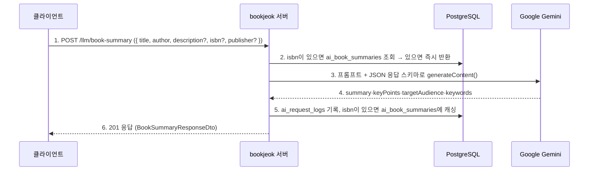

# LLM Module (`features/llm`)

`LlmModule`은 Google의 Generative AI (Gemini) 모델을 사용하여 AI 기반 기능을 제공하는 역할을 합니다. 현재는 도서의 제목과 저자 정보를 바탕으로 책의 핵심 내용 요약 및 추천 대상 분석 기능을 제공합니다.

## 1. 주요 파일 및 역할

- **`controllers/llm.controller.ts`**: `/llm` 경로의 API 엔드포인트를 정의합니다. 저장된 요약 조회(`GET`)와 요약 생성(`POST`, JWT)을 `LlmService`로 전달합니다.
- **`services/llm.service.ts`**: AI 모델과의 상호작용을 담당하는 핵심 서비스입니다.
  - `@google/generative-ai` SDK로 Gemini 모델을 초기화합니다.
  - `getSavedSummary(isbn)`: `ai_book_summaries`에 저장된 요약을 조회합니다.
  - `generateBookSummary()`: 저장본이 있으면 그대로 반환하고, 없으면 프롬프트와 JSON 응답 스키마(`summary`·`keyPoints`·`targetAudience`·`keywords`)로 모델을 호출합니다. 성공하면 `ai_book_summaries`에 ISBN 기준으로 캐싱하고, 성공·실패 모두 `ai_request_logs`(토큰·지연시간·상태)에 남깁니다.
  - 호출이 실패해도 도서 소개글이 30자를 넘으면 소개글 앞 200자로 만든 대체 요약을 반환하고, 아니면 `EXTERNAL_API_ERROR`(503)를 던집니다.
- **`dtos/book-summary.dto.ts`**: 요약 요청 본문(`title`, `author`, `description`, `isbn`, `publisher`)을 정의하고 검증합니다. 응답 형식은 `dtos/book-summary-response.dto.ts`.
- **`entities/`**: `ai-book-summary.entity.ts`(`ai_book_summaries`, ISBN별 캐시), `ai-request-log.entity.ts`(`ai_request_logs`, search 모듈의 AI 호출 로그도 같은 테이블).
- **`constants/llm-model.ts`**: 요약에 쓰는 모델명 상수(`gemini-3.1-flash-lite`). search 모듈의 RAG는 이 상수 대신 `GEMINI_MODEL_NAME` 환경 변수를 읽습니다.
- **`utils/get-prompt-text.ts`**: 프롬프트 텍스트를 만드는 유틸리티. **`utils/extract-json.ts`**는 search 모듈도 가져다 씁니다.
- **`listeners/llm-cleanup.listener.ts`**: `user.withdrawn` 이벤트로 탈퇴 회원의 AI 로그를 정리합니다.

## 2. API 엔드포인트

| HTTP Method | 경로 (`/llm/...`)     | 설명                                      | 인증 필요 |
| :---------- | :-------------------- | :---------------------------------------- | :-------- |
| `GET`       | `/book-summary/:isbn` | 저장된 AI 도서 요약 정보를 조회합니다.    | ❌        |
| `POST`      | `/book-summary`       | AI를 이용해 책 요약 및 분석을 생성합니다. | ✅ (JWT)  |

## 3. 핵심 로직 흐름

### AI 책 요약 생성

1.  **저장본 우선**: `isbn`이 있고 이미 저장된 요약이 있으면 모델을 호출하지 않습니다.
2.  **프롬프트 생성**: `getPromptText`가 제목·저자·소개글·출판사로 프롬프트를 만듭니다.
3.  **모델 호출**: 응답을 JSON 스키마로 강제하고(`temperature 0.2`) 키워드의 `#` 접두를 벗깁니다.
4.  **기록·캐싱**: 성공하면 `ai_book_summaries`에 저장합니다(저장 전 `BookService.resolveBook(isbn)`으로 도서 존재를 확인하는 가드일 뿐 도서를 만들지는 않습니다). 로그 저장이나 캐싱이 실패해도 응답은 그대로 나갑니다.
5.  **실패 시**: 소개글이 충분하면 소개글 기반 대체 요약, 아니면 503 `EXTERNAL_API_ERROR`.

AI 모델과 관련된 로직(프롬프트, API 키 관리, SDK 사용법 등)은 `LlmModule` 안에 두어 다른 비즈니스 로직과 분리합니다.
