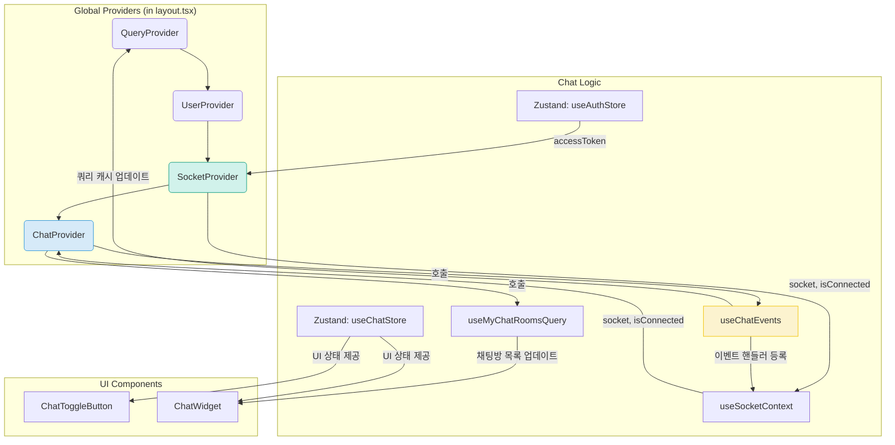
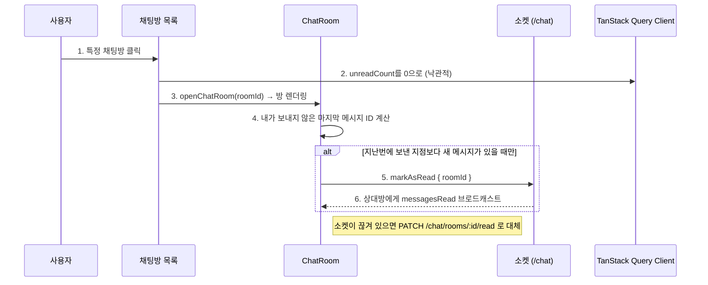

# Frontend Feature: Chat

프론트엔드의 `chat` 기능은 사용자 간의 실시간 양방향 통신을 구현합니다. 전역적으로 접근 가능한 채팅 위젯을 통해 어느 페이지에서든 대화를 이어갈 수 있는 사용자 경험을 제공합니다.

## 1. 아키텍처 및 주요 파일

채팅 기능은 여러 Provider와 컴포넌트, 훅, 스토어가 유기적으로 결합하여 동작합니다.

- **`shared/providers/socket-provider.tsx`**:
  - **역할**: 웹소켓 연결의 생명주기를 관리하는 최하위 Provider입니다.
  - **로직**: `useAuthStore`에서 Access Token을 가져와, 토큰이 있을 경우에만 Socket.IO 클라이언트 인스턴스를 생성하고 서버의 `/chat` 네임스페이스에 연결을 시도합니다. Access Token이 변경되거나 없어지면 기존 연결을 끊고 새로 연결합니다.
  - `useSocketContext` 훅을 통해 하위 컴포넌트에 `socket` 인스턴스와 연결 상태(`isConnected`)를 제공합니다.
  - `socket.io-client`는 연결할 때 동적으로 불러옵니다. 정적 import면 Node 빌드가 `ws`까지 끌고 와 모든 라우트의 서버 번들에 실리고, 콜드 스타트마다 로드됩니다. 불러오기 전에 언마운트되거나 토큰이 바뀌면 연결하지 않습니다.

- **`features/chat/providers/chat-provider.tsx`**:
  - **역할**: `SocketProvider` 위에서 실제 채팅 기능의 이벤트 리스너를 등록하고, 채팅방에 입장하는 등 채팅 관련 로직을 총괄하는 Provider입니다.
  - **로직**:
    1.  사용자가 로그인하고 소켓이 연결되면 `useChatEvents` 훅을 통해 소켓 이벤트 리스너(`newMessage`, `newChatRoom` 등)를 등록합니다.
    2.  `useMyChatRoomsQuery`로 채팅방 목록을 가져온 후, `hasJoinedRooms` 상태를 확인하여 아직 참여하지 않은 방이 있으면 `joinRooms` 이벤트를 서버로 보내 한 번에 모든 방에 참여(subscribe)합니다. 실패하면 백오프로 재시도하고, 끝내 실패하면 토스트로 알립니다.
    3.  **재연결 동기화**: 연결이 끊긴 동안 온 메시지는 소켓으로 받지 못하는데 메시지 캐시는 `staleTime: INFINITY`라 스스로 다시 받아오지 않습니다. 그래서 `connect` 리스너를 소켓 인스턴스 수명 내내 붙여 두고(연결 상태로 가두면 끊긴 사이에 리스너가 떨어져 나가 재연결을 놓칩니다), 재연결이면 방 목록을 무효화하고 열려 있는 방은 첫 페이지만 남겨 다시 받습니다. 닫혀 있는 방의 메시지 캐시는 버려 다음에 열 때 새로 받습니다.
    4.  **위젯 지연 로딩**: `ChatToggleButton`·`ChatWidget`은 `next/dynamic`(`ssr: false`)으로 불러옵니다. 마운트 후 로그인 사용자에게만 그려지므로 서버 렌더 결과는 같습니다. 정적 import였을 때는 이미지 업로드(`@vercel/blob/client` → undici, 이미지 압축)까지 루트 레이아웃을 타고 모든 라우트의 서버 번들에 실렸습니다.

- **`features/chat/hooks/use-chat-events.ts`**:
  - **역할**: 서버로부터 오는 각종 웹소켓 이벤트를 수신하고, 그에 따라 TanStack Query 캐시를 업데이트하는 로직을 모아놓은 커스텀 훅입니다.
  - **로직**: `newMessage` 이벤트를 받으면 `queryClient.setQueryData`를 사용해 해당 채팅방의 메시지 목록 캐시를 수동으로 업데이트하여 실시간으로 메시지가 보이는 것처럼 처리합니다. 또한 채팅방 목록의 마지막 메시지와 안 읽은 개수도 업데이트합니다.
  - `typing` 이벤트는 서버가 실어 보낸 `roomId`에만 반영합니다. 열려 있는 방에 무조건 적용하면 다른 방의 입력이 잘못 표시됩니다.
  - `messagesRead` 이벤트로 상대방의 읽음 지점을 받아 스토어에 반영하고, 내가 보낸 메시지의 읽음 표시에 씁니다.

- **`features/chat/hooks/use-mark-room-as-read.ts`**:
  - **역할**: 읽음 처리의 **단일 경로**입니다. 안 읽음 배지는 캐시에서 즉시 지우고(낙관적), 서버 기록은 소켓으로 보냅니다. 소켓이 끊겨 있을 때만 HTTP 요청으로 대체합니다.
  - 실제 호출은 `ChatRoom`이 "보이는 방에서 내가 보내지 않은 마지막 메시지 ID"가 올라갈 때만 합니다. 그래서 방을 열 때 · 메시지가 도착할 때마다 같은 처리가 중복으로 나가지 않습니다.

- **`features/chat/hooks/use-message-retry.ts`**:
  - **역할**: 전송에 실패한 메시지를 그 자리에서 다시 보내거나 지웁니다.
  - 재전송에 필요한 값(본문 · 이미 업로드된 이미지 URL · 상관 ID)이 실패한 메시지 자체에 들어 있어 입력창 상태에 기대지 않습니다. 이미지는 업로드된 URL을 그대로 다시 실어 보내므로 재업로드가 없습니다.

- **`features/chat/hooks/use-typing-indicator.ts`**:
  - **역할**: 채팅방에서 타이핑 상태를 관리하는 커스텀 훅입니다.
  - **로직**: `debounce`와 `throttle`을 사용하여 타이핑 시작/중지 이벤트를 효율적으로 서버에 전송합니다.

- **`features/chat/hooks/use-chat-scroll.ts`**:
  - **역할**: 채팅 스크롤 동작을 관리하는 커스텀 훅입니다.
  - **로직**: 이전 메시지 로드 시 스크롤 위치 유지, 새 메시지 도착 시 자동 스크롤, 무한 스크롤 핸들러를 제공합니다.
  - 하단 근접 여부는 ref로 추적하되 "맨 아래로" 버튼에 필요한 만큼만 상태(`isAtBottom`, `missedMessageCount`)로 승격시켜, 스크롤 중 리렌더가 쌓이지 않게 합니다.

- **`features/chat/utils/chat-cache-utils.ts`**:
  - **페이지 순서 규칙**: 과거 메시지는 `fetchPreviousPage`로 불러와 TanStack이 배열 **앞**에 붙입니다. 따라서 `pages[0]`이 가장 오래된 페이지, `pages[pages.length - 1]`이 가장 최신 페이지이고, 각 페이지 안에서는 최신 메시지가 먼저 옵니다.
  - 새 메시지는 반드시 **최신 페이지의 맨 앞**에 넣습니다. 덕분에 `flattenChatMessages`가 페이지마다 뒤집어 이어 붙이기만 하면 시간순이 되고, 메시지가 도착할 때마다 전체를 정렬하지 않아도 됩니다.

- **`features/chat/stores/use-chat-store.ts`**:
  - **역할**: 채팅 위젯의 UI 상태를 관리하는 Zustand 스토어입니다.
  - **상태**: `isChatOpen`(위젯 열림/닫힘), `activeChatRoomId`(현재 열려있는 채팅방 ID), `typingUsers`(방별 입력 중인 사용자), `isRoomInactive`(상대방 퇴장 여부), `hasJoinedRooms`(소켓 방 입장 여부), `opponentLastReadMessageId`(방별 상대방 읽음 지점) 등을 관리합니다.

- **`features/chat/components/widgets/chat-widget/`**:
  - **역할**: 위젯 패널. 한 번이라도 연 뒤에는 **닫아도 언마운트하지 않고** `visibility`로만 감춥니다.
  - **이유**: 예전에는 닫을 때마다 말풍선·첨부 이미지 DOM이 통째로 사라졌다가 열 때 다시 만들어졌습니다. 크로미움은 디코딩한 이미지를 캐시에 들고 있어 티가 덜 나지만, 웹킷(특히 iOS)은 디코딩 데이터를 훨씬 빨리 버려서 열 때마다 전부 다시 디코딩합니다. 대화가 길거나 이미지가 많은 방일수록 **사파리에서만** 다시 여는 순간이 눈에 띄게 버벅였습니다.
  - `display: none`이 아니라 `visibility: hidden`을 쓰는 이유는 레이아웃을 남겨 스크롤 위치(`scrollHeight`/`scrollTop`)를 보존하기 위해서입니다.
  - **마운트를 유지할 때 지켜야 할 규칙**: 보이지 않는 동안 도는 작업이 없어야 합니다. 현재 `isChatOpen`으로 막고 있는 것들 —
    - 읽음 처리 (`ChatRoom`): 안 보이는데 읽음 처리하면 보지도 않은 메시지가 읽음이 됩니다.
    - 주문 조회 (`ChatRoomHeader`, `TradeStatusBanner`): `refetchInterval: 5000`이라 그냥 두면 5초마다 영원히 폴링합니다.
    - 주문 상세 (`TradeMessageCard`): 폴링은 없지만 창 포커스마다 다시 받아옵니다.
    - **채팅방 안에 주기적 작업이나 쿼리를 새로 넣는다면 이 게이팅을 함께 확인하세요.**

- **`features/chat/components/`**: **Context-Based Grouping**
  - **`widgets/`**: 전역 채팅 위젯 및 토글 버튼 (`chat-widget`, `chat-toggle-button`)
  - **`room/`**: 채팅방 내부 UI (`chat-room`, `header`, `message-list`, `input`, `chat-item`)
  - **`list/`**: 채팅방 목록 (`chat-list`)

## 2. 핵심 로직 흐름

### 채팅 위젯 초기화 및 메시지 수신

사용자가 로그인했을 때 채팅 기능이 활성화되고 실시간으로 메시지를 받기까지의 과정입니다.

1.  **소켓 연결**: `SocketProvider`가 `useAuthStore`의 `accessToken`을 감지하고, 토큰이 존재하면 웹소켓 서버에 연결을 시도합니다.
2.  **이벤트 리스너 등록**: `ChatProvider`는 소켓 연결이 성공하면(`isConnected: true`), `useChatEvents` 훅을 통해 `newMessage`, `typing` 등 서버에서 보낼 이벤트를 처리할 핸들러들을 등록합니다.
3.  **채팅방 입장**: `ChatProvider`는 `useMyChatRoomsQuery`를 통해 사용자의 전체 채팅방 목록을 가져온 후, 이 목록을 기반으로 `socket.emit('joinRooms', ...)`를 호출하여 서버에게 해당 방들로부터 메시지를 구독하겠다고 알립니다.
4.  **실시간 업데이트**: 이후 다른 사용자가 메시지를 보내면, 서버는 `newMessage` 이벤트를 보냅니다. `useChatEvents`의 핸들러가 이 이벤트를 감지하고, `queryClient.setQueryData`를 사용해 TanStack Query의 캐시를 직접 업데이트하여 화면에 즉시 새로운 메시지가 표시됩니다.

### 채팅방 열기 및 메시지 읽음 처리

읽음 처리는 **경로가 하나**입니다. 예전에는 방을 열 때 HTTP `PATCH`, `ChatRoom` 마운트 시 소켓,
메시지가 도착할 때마다 다시 소켓으로 총 세 갈래가 같은 일을 했습니다.
지금은 `ChatRoom`이 "내가 보내지 않은 마지막 메시지 ID"가 올라갈 때만 한 번 보냅니다.

1.  **채팅방 열기**: `useOpenChatRoom`이 방 목록 캐시의 `unreadCount`를 즉시 0으로 만들고(낙관적) 위젯을 방 화면으로 전환합니다. 여기서는 서버 요청을 보내지 않습니다.
2.  **서버 기록**: `ChatRoom`이 메시지를 받아온 뒤, 읽음 처리가 필요한 지점이 실제로 올라갔을 때만 `useMarkRoomAsRead`로 한 번 보냅니다. 위젯을 닫았다 다시 여는 경우도 이 경로가 처리합니다.
3.  **상대방 읽음 표시**: 서버는 읽음 기록이 새로 생겼을 때만 `messagesRead { roomId, userId, lastReadMessageId }`를 방에 브로드캐스트합니다. 방을 열 때의 초기 상태는 메시지 첫 페이지 응답의 `opponentLastReadMessageId`로 채웁니다. 화면에는 **내 마지막 메시지에만** "읽음"을 붙여, 읽음 이벤트마다 내 말풍선 전부가 다시 그려지지 않게 합니다.

### 전송 실패와 재전송

전송에 실패한 메시지는 목록에서 지우지 않고 실패 상태로 남깁니다.
예전처럼 입력창으로 되돌리면, 기다리는 동안 사용자가 새로 입력한 내용과 충돌해
실패한 원문이 조용히 사라질 수 있었습니다.

- 실패한 말풍선 옆에 재전송 · 삭제 버튼이 붙습니다(`useMessageRetry`).
- 이미지는 이미 업로드된 URL이 메시지 `metadata`에 들어 있어 재업로드 없이 다시 보냅니다.
- 상관 ID(`clientMessageId`)를 그대로 다시 실어 보내므로 서버 응답이 정확히 그 말풍선을 교체합니다.

이처럼 채팅 기능은 **TanStack Query**를 통한 서버 데이터 관리, **Zustand**를 통한 UI 상태 관리, 그리고 **Socket.IO**를 통한 실시간 통신이 유기적으로 결합되어 구현되었습니다.
