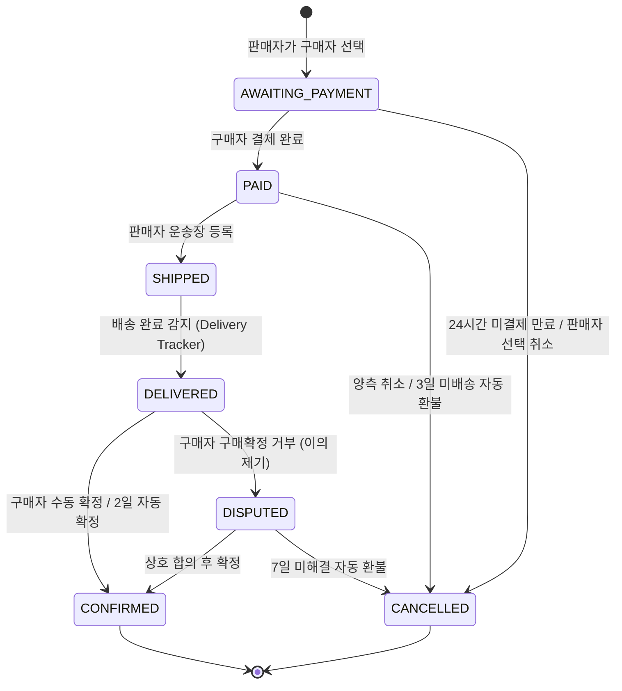

# 북적 중고거래 결제 시스템 도입 실행계획 (v2)

> [!NOTE]
> **2026-09 후속 개편 (Trade 모듈 분리)**:
> 본 문서는 결제 시스템 도입 초기 설계서입니다. 이후 직거래 후기 지원 및 결제 독립성을 위해 **거래 완료(`TradeCompletion`)와 양방향 거래 후기(`TradeReview`)가 별도의 `trade` 도메인 모듈로 분리**되었습니다.
> 결제 수명주기는 `order` 모듈이, 직거래/에스크로 완료 후기 및 신뢰 지표는 `trade` 모듈이 담당합니다. 최신 상세 구현은 다음 문서를 참고하세요:
>
> - 서버: [`apps/server/src/features/trade/README.md`](../apps/server/src/features/trade/README.md) · [`apps/server/src/features/order/README.md`](../apps/server/src/features/order/README.md)
> - 웹: [`apps/web/src/features/trade/README.md`](../apps/web/src/features/trade/README.md) · [`apps/web/src/features/order/README.md`](../apps/web/src/features/order/README.md)

## 1. 개요 및 원칙

북적 서비스에 **토스페이먼츠 에스크로 기반 결제 시스템**을 도입하여, 기존 채팅 직거래 방식에 더해 **택배 거래 + 온라인 결제 + 배송 추적 + 구매확정 + 거래 후기** 플로우를 추가한다.

### 핵심 원칙

1. **코드베이스 컨벤션 준수**: 모든 작업은 반드시 `.agents/rules/codebase-conventions.md`에 정의된 패턴(경로 상수, 에러 코드, Contract-First, 쿼리 키 팩토리, shadcn UI 재사용 등)을 엄격히 따른다.
2. **사전 리서치 강제**: 매 Phase 시작 시 관련 기존 코드를 먼저 읽고 현재 구현 패턴과 컨벤션을 확인한 뒤 코드를 작성한다.
3. **독립적 Phase 실행**: 한 번에 전체를 몰아치지 않고, 1개 Phase 단위로 작업 및 검증 게이트를 통과한 후 다음으로 진행한다.
4. **동시성 & 금액 안전**: 낙관적 잠금(`@VersionColumn`), 멱등성 키, 서버 단 금액 위변조 검증을 필수로 적용한다.
5. **타임존 일관성**: 모든 신규/수정 timestamp 컬럼은 `timestamptz`(UTC 저장)로 일치시킨다.
6. **직거래 현행 유지**: 직거래(`DIRECT_ONLY`)는 결제 없이 현행 채팅 중계 방식을 유지한다.
7. **이메일 인증 기반 신뢰 거래**: 사기 및 어뷰징 방지를 위해 중고거래(판매글 작성, 거래 채팅 개설, 구매자 지정, 결제)는 이메일 인증(`isEmailVerified: true`)을 완료한 회원에 한해 허용한다.

---

## 2. 도메인 규칙 & 결정 사항 요약

| 항목              | 결정 사항                                                                                                    |
| ----------------- | ------------------------------------------------------------------------------------------------------------ |
| **이메일 인증**   | 판매글 작성, 채팅 시작, 구매자 지정, 결제 시 `isEmailVerified === true` 필수 (`EMAIL_NOT_VERIFIED` 403 차단) |
| **거래 방식**     | 판매글 작성 시 `DIRECT_ONLY`(직거래만), `DELIVERY_ONLY`(택배만), `BOTH`(둘 다 가능) 선택                     |
| **결제 시스템**   | 토스페이먼츠 에스크로 REST API 연동                                                                          |
| **구매자 선택**   | 채팅방 내에서 판매자가 거래 상대로 선택하여 Order 생성                                                       |
| **타 구매희망자** | 타 채팅방에는 "다른 구매자와 거래 진행 중" 상태 알림                                                         |
| **결제 전 취소**  | 판매자 선택 취소 가능, 24시간 미결제 시 자동 만료                                                            |
| **결제 후 취소**  | 배송 전 양측 취소 가능, 결제 후 3일 미배송 시 자동 환불                                                      |
| **배송 중 취소**  | 배송 중(`SHIPPED`) 취소 불가                                                                                 |
| **배송 추적**     | Delivery Tracker API 연동 + 크론 폴링                                                                        |
| **구매확정**      | 배송완료 후 구매자 직접 확정 or 2일 후 자동 확정                                                             |
| **분쟁 처리**     | 구매확정 거부 시 `DISPUTED` 전환, 7일 미해결 시 자동 환불                                                    |
| **결제 금액**     | `UsedBookSale.price` 고정 (금액 협상 없음)                                                                   |
| **배송지 입력**   | 결제 시 카카오 우편번호로 입력받아 Order에 스냅샷 저장                                                       |
| **거래 후기**     | `TradeReview` 엔티티, 거래 완료 1건당 양쪽이 각각 한 건씩(양방향), 프리셋 태그 + 선택적 텍스트               |
| **후기 조건**     | 구매확정 후 14일 이내 작성/수정 가능 (삭제 불가), 프로필에 항상 공개                                         |
| **신뢰 지표**     | "거래 완료 N건 · 긍정 후기 N%" 팩트 기반 수치                                                                |
| **알림**          | 거래 단계별 11종 알림 이벤트 및 채팅방 시스템 메시지 발송                                                    |

---

## 3. 상태 머신 명세

### 3-1. OrderStatus 전이도



### 3-2. SaleStatus 연동 규칙

- **Order 생성 시 (`AWAITING_PAYMENT`)**: `UsedBookSale.status` → `RESERVED`
- **주문 취소/만료 시 (`CANCELLED`)**: `UsedBookSale.status` → `FOR_SALE`
- **구매 확정 시 (`CONFIRMED`)**: `UsedBookSale.status` → `SOLD`

---

## 4. 예외 및 엣지 케이스 방어 정책 (Edge Case Policy)

> 아래 10가지 엣지 케이스는 돈과 실물이 오가는 중고거래의 무결성을 위해 반드시 서버/클라이언트 양측에서 철저히 방어되어야 한다.

### 1) 거래 진행 중 채팅방 나가기 방어

- **정책**: 활성 거래(`AWAITING_PAYMENT`, `PAID`, `SHIPPED`, `DELIVERED`, `DISPUTED`)가 존재하는 채팅방은 참여자가 임의로 나갈 수 없다.
- **백엔드**: `ChatService.leaveRoom` 시 해당 방에 미완료 Order가 존재하면 `CHAT_CANNOT_LEAVE_DURING_TRADE` (400 Bad Request) 예외 발생.
- **프론트엔드**: 활성 거래 상태 시 나가기 버튼 비활성화 또는 클릭 시 "거래 진행 중 나가기 불가" 모달 안내.
- **예외(결제 전)**: `AWAITING_PAYMENT` 상태에서는 판매자가 "구매자 지정 취소"를 하거나, 구매자가 "거래 취소 확인"을 거쳐 Order를 `CANCELLED` 처리한 후에만 나가기 허용.

### 2) 비활성/탈퇴 참여자에 대한 구매자 지정 방어

- **정책**: 구매희망자가 이미 채팅방을 나갔거나(`isActive = false`) 탈퇴한 회원(`deletedAt != null`)인 경우, 판매자가 해당 사용자를 구매자로 지정할 수 없다.
- **백엔드**: `OrderService.selectBuyer` 시 구매자 참가자의 `isActive === true` 및 `deletedAt === null` 검증 (`CHAT_PARTICIPANT_INACTIVE` 400 예외).
- **프론트엔드**: 상대방이 나간 방에서는 "구매자 선택하기" 버튼을 비활성화하고 "상대방이 대화방을 나갔습니다" 배너 표시.

### 3) 거래 진행 중 판매글 수정 / 삭제 / 상태 임의 변경 방어

- **정책**: 활성 주문(`AWAITING_PAYMENT` ~ `DISPUTED`)이 걸려있는 판매글은 가격 수정, 게시글 삭제, 수동 상태 변경(`SOLD` 등)이 불가하다.
- **백엔드**:
  - `UsedBookSaleService.updateSale`: 활성 주문 존재 시 수정 차단 (`SALE_IN_TRADE_CANNOT_UPDATE` 409 Conflict).
  - `UsedBookSaleService.deleteSale`: 활성 주문 존재 시 삭제 차단 (`SALE_IN_TRADE_CANNOT_DELETE` 409 Conflict).
  - `UsedBookSaleService.updateStatus`: 활성 주문 존재 시 수동 상태 변경 차단 (시스템 트랜잭션으로만 상태 전이).
- **프론트엔드**: 마이페이지 판매글 관리에서 거래 중인 글은 "수정/삭제" 버튼 비활성화 및 툴팁 안내.

### 4) 거래 진행 중 회원 탈퇴(계정 삭제) 방어

- **정책**: 자신이 판매자 또는 구매자로 참여 중인 활성 주문이 남아있는 회원은 탈퇴할 수 없다.
- **백엔드**: `UserService.deleteUser` 시 활성 주문 존재 여부 확인 후 `USER_IN_TRADE_CANNOT_WITHDRAW` (400 Bad Request) 발생.
- **프론트엔드**: 회원 탈퇴 페이지/모달에서 "진행 중인 거래 완료 또는 취소 후 탈퇴 가능" 안내.

### 5) 취소된 주문 이력 보존 및 활성 주문 단일 조회 보장

- **정책**: 취소된 주문(`CANCELLED`)은 감사/이력용으로 DB에 영구 보존되며, 판매글은 `FOR_SALE`로 복귀하여 재거래가 가능하다.
- **백엔드/프론트엔드**: 채팅방 상단 배너 및 주문 조회 API(`getActiveOrderByRoom`)는 반드시 **현재 활성 주문(`status NOT IN ('CANCELLED', 'CONFIRMED')`)** 1건만 반환하도록 필터링하여, 과거 취소된 주문 데이터가 화면에 잔존하지 않도록 보장.

### 6) 결제창 방치 후 뒤늦은 결제 시도 (만료/취소 경합 방어)

- **정책**: 구매자가 결제창을 띄워둔 사이 판매자가 지정을 취소했거나 24시간 만료된 경우 결제가 승인되어서는 안 된다.
- **백엔드**: `OrderService.confirmPayment` 실행 시, 토스 결제 승인 API 호출 직전에 **Order가 `AWAITING_PAYMENT` 상태인지 + `expiresAt`이 지나지 않았는지** 트랜잭션 내에서 최종 재검증. 불일치 시 토스 승인 API를 호출하지 않고 에러 반환.

### 7) 직거래(`DIRECT_ONLY`) 판매글에서의 온라인 주문 생성 차단

- **정책**: 직거래 전용 판매글에 대해 비정상 API 호출로 Order를 생성할 수 없다.
- **백엔드**: `OrderService.selectBuyer`에서 `sale.tradeMethod === 'DIRECT_ONLY'`인 경우 `ORDER_DIRECT_ONLY_NOT_ALLOWED` (400 Bad Request) 차단.

### 8) 토스 결제 승인 후 DB 저장 실패 시 보상 트랜잭션 (자동 환불 방어)

- **정책**: 토스페이먼츠 결제 승인(과금)이 완료된 직후 DB 저장 단계에서 낙관적 락 충돌이나 서버 오류가 발생할 경우, 결제를 즉시 자동 취소(보상 트랜잭션)하여 결제와 DB 간 금액 불일치를 방지한다.
- **백엔드**: `OrderService.confirmPayment`에서 `tossPaymentsService.confirmPayment` 호출 후 `manager.save` 실패 시 `catch` 블록에서 `tossPaymentsService.cancelPayment`를 호출하여 승인 자동 취소.

### 9) 모바일 결제 리디렉션 시 배송지 스냅샷 유실 방어

- **정책**: 모바일 환경에서 앱카드/간편결제 앱 전환 후 결제 완료 콜백 리디렉션 시 브라우저 세션이 초기화되더라도 배송지 스냅샷이 유실되지 않아야 한다.
- **프론트엔드**: `order-storage.ts`에서 `sessionStorage` 단독 저장 대신 `localStorage` fallback(24시간 TTL 자동 만료)을 병행 적용하여 새 세션/새 탭 리디렉션 시에도 배송지 데이터를 안전하게 복원.

### 10) 이메일 미인증 회원의 중고거래 진입 차단 (Email Verification Guard)

- **정책**: 이메일 인증이 완료되지 않은 계정(`isEmailVerified === false`)은 허위 매물 및 피싱 방지를 위해 중고거래 핵심 기능(판매글 작성, 채팅방 개설, 구매자 지정, 결제)을 수행할 수 없다.
- **백엔드**:
  - `EmailVerifiedGuard`를 `POST /used-book-sales`, `PATCH /used-book-sales/:id`, `POST /chats/room`에 적용하여 403 Forbidden (`EMAIL_NOT_VERIFIED`) 차단.
  - `OrderService.selectBuyer`에서 판매자 및 대상 구매자 양측의 `isEmailVerified` 검증.
  - `OrderService.confirmPayment`에서 결제 시도 구매자의 `isEmailVerified` 검증.
- **프론트엔드**:
  - 판매글 작성 폼 상단 안내 배너 + 비활성화, 판매글 상세 "채팅하기" 클릭 시 인증 유도 팝업, 채팅방 상단 거래 배너 및 결제 페이지에서 미인증 사용자에게 [인증 메일 재발송] 액션 제공.

### 11) PG사 승인 전 안전 배포 및 Feature Flag 제어 (Pre-PG Launch Policy)

- **정책**: PG사 승인 및 사업자 등록 전 프로덕션/스테이징 배포 시 결제 코드는 유실 없이 병합·배포하되, 런타임에서 일반 사용자의 결제 기능 접근을 원천 차단하고 기존 직거래 채팅 중계 기능만 100% 정상 작동하도록 격리한다.
- **환경변수 플래그**:
  - 백엔드: `FEATURE_PAYMENT_ENABLED=false` (PG 승인 완료 시 `true` 전환)
  - 프론트엔드: `NEXT_PUBLIC_FEATURE_PAYMENT_ENABLED=false` (PG 승인 완료 시 `true` 전환)
- **백엔드 격리**:
  - `PaymentFeatureGuard`를 `OrderController`, `TossWebhookController`, `TradeReviewController`에 적용하여 비활성화 시 503 Service Unavailable 차단.
  - `OrderSchedulerService`의 6개 크론 잡에 플래그 가드를 적용하여 비활성화 시 0 반환 및 DB 폴링 차단.
  - `ChatService.leaveRoom`에서 플래그 OFF 시 활성 주문 검사를 우회하여 일반 채팅방 퇴장 보장.
  - `TossPaymentsService`에서 시크릿키 부재 시에도 서버 구동에 영향 없도록 안전 처리.
- **프론트엔드 격리**:
  - `TradeStatusBanner`: 플래그 OFF 시 `null` 반환 및 `useActiveOrderByRoomQuery` 차단.
  - `TradeMessageCard`: 결제 및 주문 상세 버튼 숨김 및 `useOrderDetailQuery` 차단.
  - 판매글 작성/수정 폼: `tradeMethod` 선택 UI를 숨기고 `DIRECT_ONLY`(직거래)로 기본값 고정.
  - 결제 및 주문 관련 모든 페이지 라우트(`/order/*`, `/my-page/sales-orders`): 접근 시 홈(`/`)으로 즉시 리디렉트.
  - 유저 프로필 페이지: 거래 후기 탭 및 `SellerTrustBadge` 미노출 및 관련 쿼리 비활성화.

---

## 5. Phase별 상세 실행 계획

---

### Phase 0: 스키마 & 인프라 기반 작업

> 후속 비즈니스 로직의 토대가 되는 DB 스키마 업데이트 및 패키지 설정

#### 작업 명세:

1. **타임존 정비**:
   - `ChatRoom`, `ChatMessage`의 `@CreateDateColumn()`, `@UpdateDateColumn()`에 `{ type: 'timestamptz' }` 명시 확인 및 적용.
2. **ChatMessage 엔티티 확장**:
   - `ChatMessageType` enum 추가 (`TEXT`, `SYSTEM`, `TRADE_STATUS`, `TRADE_ACTION`).
   - `type` 컬럼 (기본값 `TEXT`), `metadata` 컬럼 (`jsonb`, nullable) 추가.
3. **UsedBookSale 엔티티 확장**:
   - `TradeMethod` enum 추가 (`DIRECT_ONLY`, `DELIVERY_ONLY`, `BOTH`).
   - `tradeMethod` 컬럼 추가 (기본값 `DIRECT_ONLY`).
4. **Order 엔티티 (`apps/server/src/features/order/entities/order.entity.ts`)**:
   - Primary Key: `id: string` (`@PrimaryColumn({ type: 'varchar' })`, 'ORD-timestamp-random' 형태의 고유 주문 식별자 단일 기본키)
   - 필드: `id`, `status`(`OrderStatus`), `amount`, `paymentKey`, 배송지 스냅샷(`recipientName`, `recipientPhone`, `zipCode`, `address`, `addressDetail`), 배송정보(`carrier`, `trackingNumber`), 시각 필드들(`expiresAt`, `deliveredAt`, `disputedAt`, `paidAt`, `shippedAt`, `confirmedAt`, `cancelledAt`), 사유(`disputeReason`, `cancelReason`), `@VersionColumn() version`.
   - 관계: `sale`(`UsedBookSale`), `buyer`(`User`), `seller`(`User`), `chatRoom`(`ChatRoom`), `tradeReview`(`TradeReview` 1:1).
   - 인덱스: `[status, expiresAt]`, `[status, deliveredAt]`, `[status, disputedAt]`, `[buyerId]`, `[sellerId]`.
5. **TradeReview 엔티티 (`apps/server/src/features/order/entities/trade-review.entity.ts`)**:
   - `TradeReviewTag` enum 정의 (긍정 태그 5종, 부정 태그 4종).
   - 필드: `id`(PK, number), `orderId`(`varchar`, `Order.id` 참조), `order`(`Order` 1:1), `reviewer`(`User`), `targetUser`(`User`), `tags`(`simple-array`), `content`(text, nullable), `createdAt`, `updatedAt`(`timestamptz`).
   - 인덱스: `[targetUserId, createdAt]`.
6. **라이브러리 및 모듈 설정**:
   - `@nestjs/schedule` 설치 및 `apps/server/src/app/app.module.ts`에 `ScheduleModule.forRoot()` 등록.
   - `@tosspayments/tosspayments-sdk` (web) 및 `react-daum-postcode` (web) 설치.
   - 환경변수 템플릿(`.env.example`)에 토스 키 추가.

#### 검증 게이트:

```bash
cmd.exe /c "pnpm --filter @bookjeok/core build"
cmd.exe /c "pnpm --filter @bookjeok/server exec tsc --noEmit"
cmd.exe /c "pnpm --filter @bookjeok/server test"
```

---

### Phase 1: Core Order 서비스 (백엔드)

> 주문 상태 전이 로직, 동시성 안전 처리, TDD 기반 단위 테스트 작성

#### 작업 명세:

1. **에러 코드 등록 (`apps/server/src/shared/exceptions/error-codes.ts`)**:
   - `ORDER_NOT_FOUND`, `ORDER_INVALID_STATUS`, `ORDER_CONCURRENT_MODIFICATION`, `ORDER_AMOUNT_MISMATCH`, `ORDER_FORBIDDEN` 등 등록.
2. **Order 모듈 및 DTO 구성**:
   - `create-order.dto.ts`, `confirm-payment.dto.ts`, `register-shipping.dto.ts`, `dispute-order.dto.ts`, `cancel-order.dto.ts`, `query-order.dto.ts`.
   - `order.module.ts` 정의 및 `app.module.ts` 등록.
3. **OrderService 상태 전이 로직 구현**:
   - `selectBuyer`: 판매글 상태 확인, 활성 주문 중복 방지, Order 생성 (`id: string` PK, `AWAITING_PAYMENT`, 24h 만료 설정), SaleStatus → `RESERVED`.
   - `cancelSelection`: 결제 전 선택 취소, Order → `CANCELLED`, SaleStatus → `FOR_SALE`.
   - `confirmPayment`: 결제 금액 위변조 검증, 토스 승인 API 호출, DB 저장 실패 시 토스 결제 자동 취소(보상 트랜잭션), Order → `PAID`, 3일 미배송 취소 타이머 설정.
   - `registerShipping`: 판매자 확인, Order → `SHIPPED`, 송장번호 저장.
   - `markDelivered`: Order → `DELIVERED`, 2일 자동구매확정 타이머 설정.
   - `confirmPurchase`: 구매자 확인, Order → `CONFIRMED`, SaleStatus → `SOLD`.
   - `disputeOrder`: Order → `DISPUTED`, 7일 미해결 자동환불 타이머 설정.
   - `cancelOrder`: 배송 전 결제 취소 처리, SaleStatus → `FOR_SALE`.
   - 모든 상태 전이에 낙관적 잠금 버전 체크 적용.
4. **OrderController 라우트 구현**:
   - `POST /orders/select-buyer`, `POST /orders/:id/pay`, `POST /orders/:id/ship`, `POST /orders/:id/confirm`, `POST /orders/:id/dispute`, `POST /orders/:id/cancel`, `DELETE /orders/:id/selection`, `GET /orders/my-purchases`, `GET /orders/my-sales`, `GET /orders/:id` (모든 `:id` 파라미터는 `string` 수신).
5. **TDD 테스트 작성 (`order.service.spec.ts`)**:
   - 정상 플로우 및 15개 이상의 엣지 케이스(동시 요청, 금액 불일치, 비인가 사용자, 배송 중 취소 불가, 승인 후 DB 실패 시 보상 트랜잭션 등) 테스트 작성 및 통과.

#### 검증 게이트:

```bash
cmd.exe /c "pnpm --filter @bookjeok/server exec tsc --noEmit"
cmd.exe /c "pnpm --filter @bookjeok/server test"
```

---

### Phase 2: 토스페이먼츠 에스크로 연동 (백엔드)

> 토스페이먼츠 에스크로 승인, 배송등록, 구매확정, 취소 REST API 연동 및 웹훅 처리

#### 작업 명세:

1. **TossPaymentsService 구현 (`apps/server/src/features/order/services/toss-payments.service.ts`)**:
   - Basic Auth (Secret Key base64 인코딩) 기반 Axios 통신 모듈.
   - `confirmEscrowPayment`: 에스크로 결제 승인 API 호출.
   - `registerShipping`: 에스크로 배송 정보 등록 API 호출.
   - `confirmEscrowPurchase`: 에스크로 구매확정 API 호출.
   - `rejectEscrowPurchase`: 에스크로 구매거부 API 호출.
   - `cancelPayment`: 결제 취소/환불 API 호출.
   - `verifyWebhook`: 토스 웹훅 시그니처 검증.
2. **OrderService와 TossPaymentsService 연동**:
   - 결제 승인/배송/확정/취소 시 실제 토스 API 호출 결합 및 DB 실패 시 보상 트랜잭션 연계.
3. **토스 웹훅 수신 컨트롤러 (`apps/server/src/features/order/controllers/toss-webhook.controller.ts`)**:
   - `POST /orders/webhook/toss` 구현 (결제 상태 동기화).
4. **Mock 기반 TossPaymentsService 단위 테스트 작성**.

#### 검증 게이트:

```bash
cmd.exe /c "pnpm --filter @bookjeok/server exec tsc --noEmit"
cmd.exe /c "pnpm --filter @bookjeok/server test"
```

---

### Phase 3: 배송 추적 & 스케줄러 자동화 (백엔드)

> Delivery Tracker 연동 및 크론 잡 기반 자동 만료/확정/환불 처리

#### 작업 명세:

1. **DeliveryTrackerService 구현**:
   - 한국 주요 택배사(CJ대한통운, 롯데, 한진, 로젠, 우체국 등) 배송 상태 조회 API.
   - 배송 완료 여부 판별 유틸.
2. **OrderSchedulerService 구현 (`@nestjs/schedule` 크론)**:
   - `handleExpiredOrders` (5분 간격): 24시간 미결제 주문 자동 취소 및 `order.expired`(`chatRoomId` 포함) 이벤트 발행.
   - `handleUnshippedOrders` (5분 간격): 결제 후 3일 미배송 주문 자동 취소 + 환불 및 `order.unshipped_cancelled` 이벤트 발행.
   - `handleAutoConfirm` (5분 간격): 배송완료 후 2일 경과 주문 자동 구매확정 및 `order.auto_confirmed` 이벤트 발행.
   - `handleExpiredDisputes` (5분 간격): 분쟁 후 7일 미해결 주문 자동 환불 및 `order.dispute_expired_refunded` 이벤트 발행.
   - `pollDeliveryStatus` (30분 간격): 배송 중(`SHIPPED`) 주문의 배송 상태 추적 및 완료 감지 시 `markDelivered` 호출 (중복 이벤트 발행 방지).
   - `sendExpiryWarnings` (매일 00:00 UTC): 자동확정 D-1, 배송기한 D-1 사전 알림 발송.
3. **스케줄러 단위 테스트 작성**.

#### 검증 게이트:

```bash
cmd.exe /c "pnpm --filter @bookjeok/server exec tsc --noEmit"
cmd.exe /c "pnpm --filter @bookjeok/server test"
```

---

### Phase 4: 거래 후기 시스템 (백엔드)

> 구매확정 후 판매자에 대한 평가 및 태그 기반 통계 집계

#### 작업 명세:

1. **에러 코드 등록**:
   - `TRADE_REVIEW_ALREADY_EXISTS`, `TRADE_REVIEW_EXPIRED`(14일 초과), `TRADE_REVIEW_FORBIDDEN` 등.
2. **TradeReviewService 구현**:
   - `createReview`: 구매자 본인 검증, 구매확정 상태 검증, 14일 기한 검증(`confirmedAt` 또는 `updatedAt` 기준 fallback), 중복 작성 방지.
   - `updateReview`: 작성자 본인 검증, 태그/내용 수정.
   - `getReviewsByTargetUser`: 특정 판매자의 거래 후기 목록 조회 (페이지네이션).
   - `getSellerStats`: 판매자 총 거래완료 수, 긍정 후기 비율(%), 태그별 빈도수 집계.
3. **TradeReviewController 구현**:
   - `POST /trade-reviews`, `PATCH /trade-reviews/:id`, `GET /trade-reviews/user/:handle`, `GET /trade-reviews/user/:handle/stats`.
4. **TradeReviewService 단위 테스트 작성**.

#### 검증 게이트:

```bash
cmd.exe /c "pnpm --filter @bookjeok/server exec tsc --noEmit"
cmd.exe /c "pnpm --filter @bookjeok/server test"
```

---

### Phase 5: 알림 및 채팅 시스템 메시지 통합 (백엔드)

> 거래 상태 변경에 따른 11종 알림 발행 및 채팅방 시스템 메시지 전송

#### 작업 명세:

1. **NotificationType 확장**:
   - `BUYER_SELECTED`, `OTHER_BUYER_TRADING`, `PAYMENT_COMPLETED`, `PAYMENT_EXPIRED`, `SHIPPING_STARTED`, `DELIVERY_COMPLETED`, `AUTO_CONFIRM_IMMINENT`, `PURCHASE_CONFIRMED`, `ORDER_CANCELLED`, `SHIPPING_DEADLINE_IMMINENT`, `TRADE_REVIEW_RECEIVED`.
2. **알림 전략 및 이벤트 리스너 구현**:
   - `OrderEventListener`를 통해 주문 상태 변경 이벤트 수신 → 적절한 수신자에게 `NotificationService.createNotification` 호출.
3. **채팅 시스템 메시지 발송 (`ChatService.sendTradeMessage`)**:
   - 거래 이벤트 발생 시 해당 채팅방에 `TRADE_ACTION` or `TRADE_STATUS` 타입의 메시지 저장 및 소켓 브로드캐스트.
   - 타 구매희망자 채팅방에 "다른 구매자와 거래 진행 중" 메시지 발송.
4. **알림 및 채팅 발송 단위 테스트 작성**.

#### 검증 게이트:

```bash
cmd.exe /c "pnpm --filter @bookjeok/server exec tsc --noEmit"
cmd.exe /c "pnpm --filter @bookjeok/server test"
```

---

### Phase 6: 공유 패키지 계약 (Contract) 업데이트

> `@bookjeok/core`, `@bookjeok/api-client`, `@bookjeok/react-query` 동기화

#### 작업 명세:

1. **`@bookjeok/core`**:
   - `packages/core/src/features/order/types.ts`: `OrderStatus`, `TradeMethod`, `TradeReviewTag`, `Order`(`id: string` PK), `TradeReview`(`orderId: string`), `SellerTradeStats`, 요청/응답 인터페이스 (모든 식별자는 `orderId: string` 기준).
   - `packages/core/src/features/book-sale/types.ts`: `UsedBookSale` 및 `CreateBookSaleParams`에 `tradeMethod` 필드 추가.
   - `packages/core/src/features/chat/types.ts`: `ChatMessage`에 `type`, `metadata` 추가.
   - `packages/core/src/features/notification/types.ts`: 신규 `NotificationType` 추가.
   - `packages/core/src/shared/constants/apis.ts`: `API_PATHS.order`, `API_PATHS.tradeReview` 섹션 추가.
   - `packages/core/src/features/order/query-keys.ts`: `orderKeys` (`detail: (orderId: string)`), `tradeReviewKeys` 팩토리 정의.
   - `packages/core/src/index.ts`: export 등록.
2. **`@bookjeok/api-client`**:
   - `packages/api-client/src/features/order/apis.ts`: `orderApi` (모든 메서드 `orderId: string` 수신), `tradeReviewApi` 구현 (경로는 반드시 `API_PATHS` 참조).
   - `packages/api-client/src/index.ts`: export 등록.
3. **`@bookjeok/react-query`**:
   - `packages/react-query/src/features/order/queries.ts`: `useMyPurchasesQuery`, `useMySalesOrdersQuery`, `useOrderDetailQuery` (`orderId: string`), `useSellerStatsQuery`, `useUserTradeReviewsQuery`.
   - `packages/react-query/src/features/order/mutations.ts`: `useSelectBuyerMutation`, `useConfirmPaymentMutation`, `useRegisterShippingMutation`, `useConfirmPurchaseMutation`, `useDisputeOrderMutation`, `useCancelOrderMutation`, `useCreateTradeReviewMutation` 등 (캐시 무효화 포함).
   - `packages/react-query/src/index.ts`: export 등록.

#### 검증 게이트:

```bash
cmd.exe /c "pnpm --filter @bookjeok/core build"
cmd.exe /c "pnpm --filter @bookjeok/api-client build"
cmd.exe /c "pnpm --filter @bookjeok/server exec tsc --noEmit"
cmd.exe /c "pnpm --filter @bookjeok/web exec tsc --noEmit"
```

---

### Phase 7: 채팅 UI 거래 기능 (프론트엔드)

> 채팅방 상단 거래 상태 배너, 시스템 메시지 카드, 구매자 선택 UI, 판매글 거래방식 선택

#### 작업 명세:

1. **경로 상수 등록 (`apps/web/src/shared/constants/paths.ts`)**:
   - `ORDER_PAYMENT`, `ORDER_DETAIL`, `MY_PURCHASES`, `MY_SALES_ORDERS` 등 라우트 상수 등록.
2. **거래 상태 배너 (`TradeStatusBanner`)**:
   - 채팅방 상단에 고정되어 주문 상태(`OrderStatus`) 및 사용자 역할(판매자/구매자)에 맞춘 상태 안내 및 액션 버튼(결제하기, 배송등록, 구매확정 등) 노출.
3. **시스템 메시지 카드 (`TradeMessageCard`)**:
   - `ChatMessageType.TRADE_STATUS` 및 `TRADE_ACTION`에 따라 카드형 UI 렌더링.
4. **구매자 선택 모달 (`SelectBuyerModal`)**:
   - 판매자가 채팅 중인 상대방을 구매자로 지정하는 모달 및 뮤테이션 연동.
5. **판매글 등록/수정 폼 수정**:
   - 거래 방식(`tradeMethod`: 직거래만/택배만/둘 다) 라디오/선택 컴포넌트 추가 및 상세 화면 뱃지 표시.

#### 검증 게이트:

```bash
cmd.exe /c "pnpm --filter @bookjeok/web exec tsc --noEmit"
cmd.exe /c "pnpm --filter @bookjeok/web test"
```

---

### Phase 8: 결제 플로우 UI (프론트엔드)

> 카카오 주소 입력, 주문서 페이지, 토스 SDK 결제창 연동, 결과 페이지

#### 작업 명세:

1. **배송지 입력 폼 (`AddressInput`) 및 스토리지 관리 (`order-storage.ts`)**:
   - `react-daum-postcode` 연동 우편번호/기본주소 검색 + 상세주소 및 수령인 정보 입력.
   - 모바일 외부 리디렉션 대응 `sessionStorage` + `localStorage` (24h TTL) 배송지 스냅샷 유실 방어.
2. **주문서/결제 페이지 (`/order/payment/[orderId]`)**:
   - 상품 정보 요약, 배송지 폼, 결제 금액 확인.
   - 토스페이먼츠 SDK `requestPayment` 호출.
3. **결제 성공/실패 페이지**:
   - `success/page.tsx`: 쿼리 파라미터(`paymentKey`, `orderId`, `amount`) 수신 → 서버 `confirmPayment` 호출 → 완료 화면 또는 주문 상세로 이동.
   - `fail/page.tsx`: 에러 메시지 표시 및 재시도 안내.

#### 검증 게이트:

```bash
cmd.exe /c "pnpm --filter @bookjeok/web exec tsc --noEmit"
cmd.exe /c "pnpm --filter @bookjeok/web test"
```

---

### Phase 9: 주문 관리 UI (프론트엔드)

> 내 구매/판매 주문 목록, 주문 상세, 운송장 등록 및 분쟁 제기 모달

#### 작업 명세:

1. **내 주문 목록 페이지**:
   - `/my-page/purchases`: 구매 내역 카드 목록, 상태별 탭 필터.
   - `/my-page/sales-orders`: 판매 주문 내역 카드 목록, 배송지 확인 및 송장 입력 진입점.
2. **주문 상세 페이지 (`/order/[orderId]`)**:
   - 주문 진행 상태 타임라인 바.
   - 도서 정보, 결제 금액, 배송지 스냅샷, 배송 추적 현황.
   - 상태별 액션 버튼 (운송장 등록, 구매확정, 문제 신고 등).
3. **모달 컴포넌트**:
   - `ShippingFormModal`: 택배사 선택 + 운송장 번호 입력.
   - `DisputeModal`: 구매확정 거부 사유 입력.

#### 검증 게이트:

```bash
cmd.exe /c "pnpm --filter @bookjeok/web exec tsc --noEmit"
cmd.exe /c "pnpm --filter @bookjeok/web test"
```

---

### Phase 10: 거래 후기 UI (프론트엔드)

> 후기 작성 폼, 프로필 거래 후기 탭, 판매자 신뢰 지표 표시

#### 작업 명세:

1. **거래 후기 작성 폼/모달 (`TradeReviewForm`)**:
   - 프리셋 태그(긍정/부정) 선택 칩 + 한 줄 텍스트 입력 textarea.
   - 구매확정 완료 시 자동 노출 또는 주문 상세에서 진입.
2. **사용자 프로필 페이지 수정 (`/users/[handle]`)**:
   - "거래 후기" 탭 추가: 태그별 집계 수치 및 후기 카드 리스트.
   - 프로필 헤더에 "거래 완료 N건 · 긍정 후기 N%" 신뢰 지표 노출.
3. **판매글 상세 화면 수정**:
   - 판매자 프로필 요약 카드에 거래 통계 신뢰 지표 추가.

#### 검증 게이트:

```bash
cmd.exe /c "pnpm --filter @bookjeok/web exec tsc --noEmit"
cmd.exe /c "pnpm --filter @bookjeok/web test"
```

---

### Phase 11: E2E 통합 검증 & 회귀 테스트

> 전체 10대 핵심 시나리오 E2E 테스트 및 직거래 기능 회귀 검증

#### 검증 시나리오:

1. 정상 택배 거래 플로우 (글작성 → 채팅 → 구매자선택 → 결제 → 송장입력 → 배송완료 → 구매확정 → 후기).
2. 24시간 미결제 자동 만료 → 판매글 `FOR_SALE` 복귀.
3. 3일 미배송 자동 취소 및 환불.
4. 배송완료 2일 후 자동 구매확정 → 판매글 `SOLD`.
5. 구매확정 거부(분쟁) → 7일 미해결 시 자동 환불.
6. 배송 전 판매자/구매자 합의 취소 → 환불.
7. 직거래(`DIRECT_ONLY`) 글 등록 시 결제 버튼 비노출 및 기존 채팅 플로우 유지.
8. 금액 위변조 및 동시 결제 시도 시 차단 검증.

#### 최종 통합 검증 게이트:

```bash
cmd.exe /c "pnpm --filter @bookjeok/core build"
cmd.exe /c "pnpm --filter @bookjeok/api-client build"
cmd.exe /c "pnpm --filter @bookjeok/server exec tsc --noEmit"
cmd.exe /c "pnpm --filter @bookjeok/web exec tsc --noEmit"
cmd.exe /c "pnpm --filter @bookjeok/server test"
cmd.exe /c "pnpm --filter @bookjeok/web test"
```

---

### Phase 12: 안전 배포 & 점진적 롤아웃 (Feature Flagging)

> PG사 승인/사업자 등록 전 코드는 병합 및 배포하되 결제 접근은 완벽히 격리·차단

#### 작업 명세:

1. **환경변수 플래그 추가**:
   - `FEATURE_PAYMENT_ENABLED=false` (서버)
   - `NEXT_PUBLIC_FEATURE_PAYMENT_ENABLED=false` (웹)
2. **백엔드 보안 가드 & 스케줄러 격리**:
   - `PaymentFeatureGuard`: `OrderController`, `TossWebhookController`, `TradeReviewController`에 503 차단 적용.
   - `OrderSchedulerService`: 6개 크론 잡 전체에 `isPaymentEnabled()` 검사 및 조기 반환 적용.
   - `ChatService.leaveRoom`: 플래그 비활성화 시 활성 주문 검사 우회하여 일반 채팅 기능 영향 방지.
   - `TossPaymentsService`: 시크릿 키 부재 시에도 서버 구동 실패 방지.
3. **프론트엔드 UI & 라우트 격리**:
   - `TradeStatusBanner`: 플래그 OFF 시 `null` 반환 및 주문 쿼리 비활성화.
   - `TradeMessageCard`: 결제 및 상세 버튼 숨김 및 주문 쿼리 비활성화.
   - `BookSaleForm` / `BookSaleEditForm`: `tradeMethod` 선택 UI 숨김 및 기본값 `DIRECT_ONLY` 고정.
   - 주문/결제 라우트(`/order/*`, `/my-page/sales-orders`): 접근 시 홈(`/`) 리디렉트.
   - `UserProfile`: 거래 후기 탭 및 `SellerTrustBadge` 숨김 및 쿼리 비활성화.
4. **동작 검증**:
   - `FEATURE_PAYMENT_ENABLED=false` 환경에서 기존 직거래 등록, 채팅 중계, 방 나가기 플로우 100% 정상 작동 확인.
   - 모노레포 전체 패키지 빌드(`pnpm build`) 100% 성공 검증.
